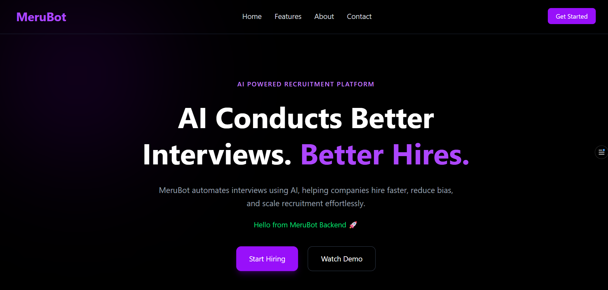
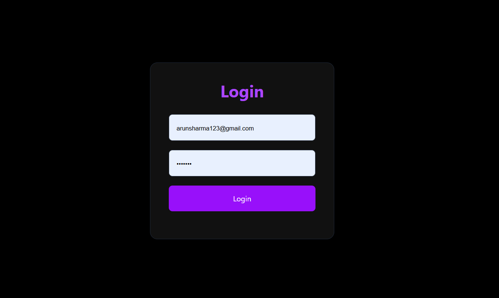
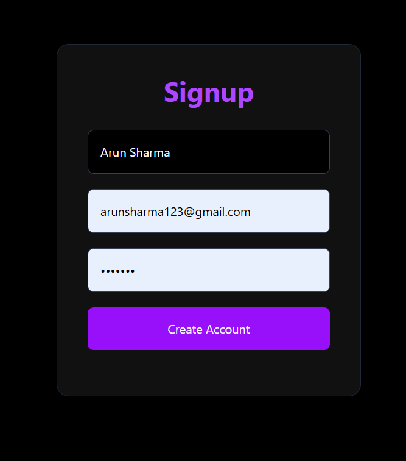
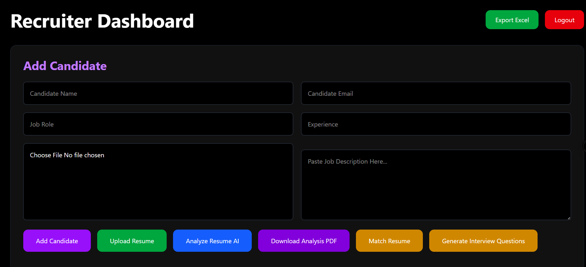
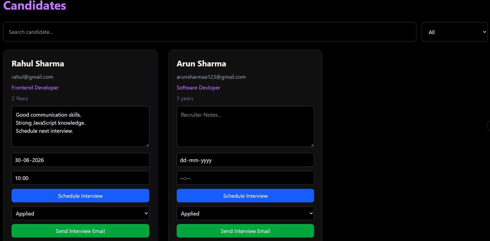
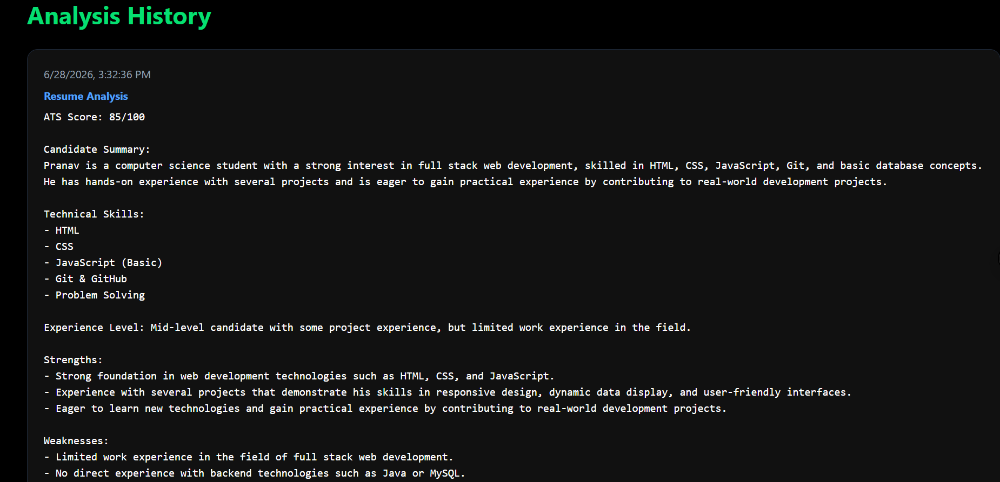
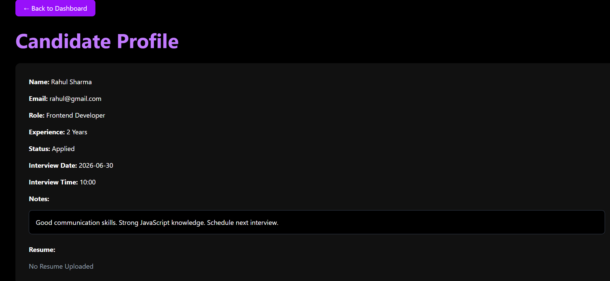

# 🤖 MeruBot – AI Powered Recruitment Platform

MeruBot is a full-stack AI-powered recruitment platform that helps recruiters automate the hiring process. It provides resume analysis, AI-powered interview question generation, candidate management, analytics, and hiring reports.

---

## 🚀 Live Demo

### Frontend
https://merubot.vercel.app

### Backend API
https://merubot.onrender.com

---

## ✨ Features

### Authentication
- User Signup
- User Login
- Logout

### Candidate Management
- Add Candidate
- View Candidate
- Update Candidate
- Delete Candidate
- Candidate Status Management

### Resume Management
- Upload Resume (PDF)
- View Resume
- Resume Storage

### AI Features
- AI Resume Analysis
- AI Job Matching
- AI Interview Question Generator
- AI Answer Evaluation

### Reports
- Download PDF Report
- Export Excel

### Email
- Send Interview Invitation Emails

### Dashboard
- Candidate Dashboard
- Analytics
- Rankings
- History

---

## 🛠 Tech Stack

### Frontend
- React
- Vite
- React Router
- Axios
- Tailwind CSS

### Backend
- Node.js
- Express.js

### Database
- MongoDB Atlas
- Mongoose

### AI
- Google Gemini API (or your AI provider)

### Deployment
- Frontend: Vercel
- Backend: Render

### Version Control
- Git
- GitHub

---

## 📂 Project Structure

```
MeruBot/
│
├── frontend/
│   ├── src/
│   ├── public/
│   └── package.json
│
├── backend/
│   ├── controllers/
│   ├── routes/
│   ├── models/
│   ├── middleware/
│   ├── uploads/
│   └── server.js
│
└── README.md
```

---

## ⚙ Installation

### Clone Repository

```bash
git clone https://github.com/Pranav0923/merubot.git
```

### Install Frontend

```bash
cd frontend
npm install
npm run dev
```

### Install Backend

```bash
cd backend
npm install
npm start
```

---

## Environment Variables

Backend `.env`

```env
MONGO_URI=YOUR_MONGODB_URI

JWT_SECRET=YOUR_SECRET

EMAIL_USER=YOUR_EMAIL

EMAIL_PASS=YOUR_APP_PASSWORD

GEMINI_API_KEY=YOUR_API_KEY
```

Frontend `.env`

```env
VITE_API_URL=https://merubot.onrender.com
```

---

## 📸 Screenshots

### 🏠 Home Page



---

### 🔐 Login Page



---

### 📝 Signup Page



---

### 📊 Dashboard



---

### 👥 Candidate List



---

### 🤖 AI Resume Analysis



---

### 👤 Candidate Profile



---

## 👨‍💻 Developer

**Pranav Ghorpade**

Computer Science Engineering Student

Specialization: Full Stack Web Development

GitHub:
https://github.com/Pranav0923

---

## ⭐ Future Improvements

- JWT Authentication
- Role Based Access
- Real-time Notifications
- AI Chat Assistant
- Calendar Integration
- Mobile Responsive Improvements

---

## 📜 License

This project is developed for educational and portfolio purposes.
